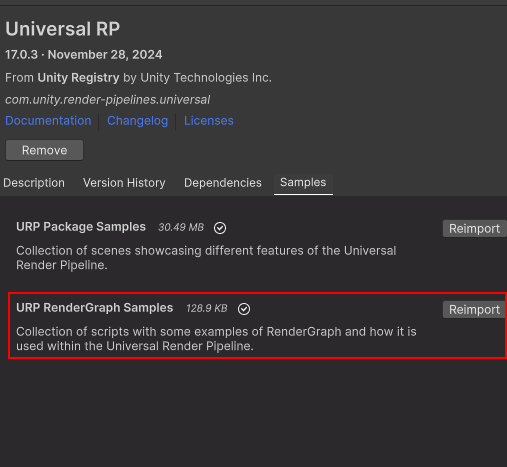
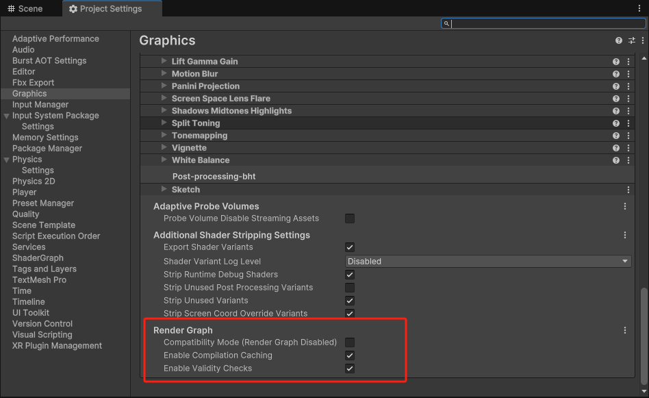
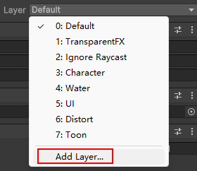
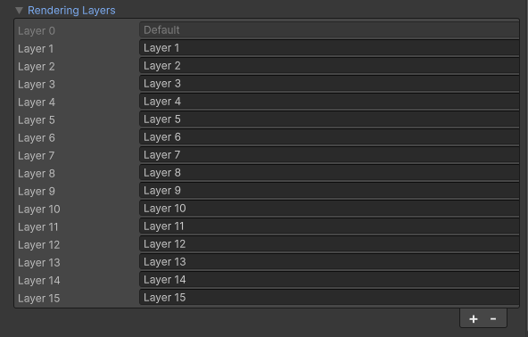

# Render Graph
***

|[](../../assets/img/render_graph/image.png){:target="_blank" rel="noopener noreferrer"}|[](../../assets/img/render_graph/image2.png){:target="_blank" rel="noopener noreferrer"}|


## RenderGraph
>入口
```c#
public override void RecordRenderGraph(RenderGraph renderGraph, ContextContainer frameData){}
```
在入口函数中我们开启RnenderGrpah流程

## SourceData
```c#
//使用frameData.Get<T> 获取所需的对象
UniversalResourceData resourceData = frameData.Get<UniversalResourceData>();
UniversalCameraData cameraData = frameData.Get<UniversalCameraData>();
UniversalRenderingData renderingData = frameData.Get<UniversalRenderingData>();
UniversalLightData lightData = frameData.Get<UniversalLightData>();
UniversalShadowData shadowData = frameData.Get<UniversalShadowData>();
```

## TextureHandle
>使用TextureHandle进行具体绘制,unity推荐使用它替代RenderTexture
```c#
//TextureHandle被RenderGraph管理，会自动复用或释放
//创建TextureHandle的方式有很多，这里只是示例
TextureHandle shadowTexture = UniversalRenderer.CreateRenderGraphTexture(renderGraph, 
shadowTextureDesc, 
k_perObjectShadowTextureName, 
true,
 sampleFilter ? FilterMode.Point : FilterMode.Bilinear);
```

## Builder
* set
```c#
//启用RT
builder.UseTexture
//启用渲染队列
builder.UseRendererList
//启用渲染委托（执行具体渲染Pass）
builder.SetRenderFunc
//MRT Set
/创建MRT目标
for (int i = 0; i < 3; i++)
{
    handles[i] = renderGraph.ImportTexture(m_RTs[i], m_RTInfos[i]);
}
//将对应目标填入对应通道中
for (int i = 0; i < 3; i++)
{
    builder.SetRenderAttachment(handles[i], i);
}
```
在builder作用域内进行流程控制，我们需要一个PassData类，方便在流程中传递数据

```c#
using (var builder = renderGraph.AddRasterRenderPass<PassData>(passName, out PassData passData))
{
     passData.material = null;
     passData.source = resourceData.activeColorTexture;
     passData.destination = texture;
     //builder中使用流程资源时，需要use
     builder.UseTexture(passData.source);
     //在Raster如果我们做DrawMesh之类的操作，使用到了Rt我们需要声明Source是谁，target是谁
     //builder.SetInputAttachment设置renderSource
     //builder.SetRenderAttachment设置renderTarget
     builder.SetRenderAttachment(passData.destination, 0);
    //绘制委托事件,注意！不能在渲染委托内循环创建renderlistHandle
     builder.SetRenderFunc((PassData passData, RasterGraphContext rgContext) => ExecutePass(passData, rgContext));
}

//继承RasterGraphContext进行具体绘制,因为外部已经设置target，这里BlitTexture只填写SourcTexture
 static void ExecutePass(PassData data, RasterGraphContext rgContext)
{
    if (data.material == null)
        Blitter.BlitTexture(rgContext.cmd, data.source, scaleBias, 0, false);
    else
        Blitter.BlitTexture(rgContext.cmd, data.source, scaleBias, data.material, 0);

    //draw mesh，如果外部已经输入source，drawProcedural的material将自动采样source，需要材质内贴图名称为_BlitTexture
    context.cmd.DrawProcedural(Matrix4x4.identity, data.material, data.useMSAA? 1 : 0, MeshTopology.Triangles, 3, 1, null);
}
```

## AddPass下列几种
* AddBlitPass
```c#
//单次开启一个渲染pass，在Parameters中设置source、destination、material
RenderGraphUtils.BlitMaterialParameters para = new(source, destination, m_Material, 0);
renderGraph.AddBlitPass(para, "CopyColor");
```
* AddCopyPass
>受限的blit拷贝操作，为了利用gpu帧缓冲数据，他要求尺寸、msaa，filter等设置一致

```c#
//基础的blit pass，可以当作ping pong时的便捷调用
renderGraph.AddCopyPass(resourceData.activeColorTexture, destination, passName: passName);

renderGraph.AddCopyPass(destination, resourceData.activeColorTexture, passName: passName);
```
* AddRasterRenderPass
```c#
//作为有限光栅绘制时使用,RasterGraphContext不能像以往Execute函数内创建的commondBuffer一样，使用不安全权限，例如多次setRenderTarget，在Raster中渲染调用会尽可能的合并渲染设置
```
* AddUnsafePass
>unsaf 与 raster最大的区别是，raster会在流程中最大可能的合并SetRenderTarget，每次set都需要创建RasterGraphContext，而如果我们清楚的了解自己的光栅流程无法在set过程合并（target 尺寸不同），那么我们就采用unsaf流程，这样我们就不需要重复创建光栅器
```c#
CommandBuffer unsafeCmd = CommandBufferHelpers.GetNativeCommandBuffer(context.cmd);
//使用不安全pass，这样我们就可以手动控制setTarget
context.cmd.SetRenderTarget(underWatermask, underWaterdepth);
context.cmd.ClearRenderTarget(true, true, Color.black);
```

## RenderTexture
>我们仍然可以使用RenderTexture作为渲染目标，持久化渲染结果（帧冻结），在unity6中它被包装为了RTHandle
```c#

RTHandles.Alloc(renderTextures[i], name:kName);
//这个方法会根据RT是否变化做对应的重建或释放
RenderingUtils.ReAllocateHandleIfNeeded(ref handle, descriptor, FilterMode.Point, TextureWrapMode.Clamp, name: sName);
```
在builder作用域内，启用

```c#
TextureHandle underWaterMask = renderGraph.ImportTexture(m_Settings.m_UnderWaterMask);
```

|||


如果希望renderList在循环内每次绘制不同物体，那么RenderList要创建对应RendererListParams
可以使用LayerMask，RenderingLayerMask来筛选物体，建议后者，因为LayerMask可能很紧张
```c#
//作用域内创建不同筛选条件的RenderList，并依此use
foreach (var item in shadowItems)
{
    var param = InitRendererListParams(renderingData, cameraData, lightData, item);
    var rlHandle = renderGraph.CreateRendererList(param);
    builder.UseRendererList(rlHandle);
    passData.rendererListHandles.Add(rlHandle);
}
//渲染委托内，执行与use的renderlist 数量相同的循环，此时便可以cmd.DrawRendererList(data.rendererListHandles[i]);绘制不同的renderers
builder.SetRenderFunc((PassData data, RasterGraphContext context) =>
{
    ExecutePass(data, context);
});
```
***
[back](../../coding-page.html)